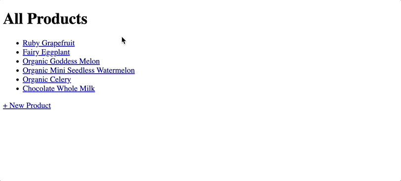

# Mongoose-with-Express

This project integrates **Mongoose** with **Express** to create a **Mongo** database and a simple **Express** web app. The app is built with **RESTful** routes and it implements **CRUD** functionality. Users can add new products, edit existing product information, and delete unwanted products from the database.

## 🎉 Demo 




## ✨ What I Have Learned

**MongoDB** is a **NoSQL** database that's non-relational. To connect **MongoDB** with **JavaScript**, we use a library called **Mongoose**. **Mongoose** uses schemas (mappings of different collection keys from **Mongo** to different types in **JavaScript**) to model the data an application wishes to store and manipulate in **MongoDb**. This includes features such as type casting and validations.

With **Mongoose**, we would define a `Schema` object to preset the structure for documents (files/containers of individual items) in the collection (a group of documents). Then we need to create a `Model` object based off the schema to create instances and represent information in a **Mongo** database.

## 💻 Setup

1️⃣ Run the command below to install packages used in the project:
```sh

$ npm install

```
2️⃣ Install nodemon globally so that it'll restart the application when changes are made to the project:
```sh

$ npm install -g nodemon

```


3️⃣ Run `nodemon index` in the terminal to start the server, and connect to `http//localhost:3000` in the web browser.

## 👏 Credits

This project is based on the <a href="https://getbootstrap.com/docs/4.6/getting-started/introduction/">Bootstrap Documentation<a/> and the MongoDB and Mongoose tutorials of <a href="https://www.udemy.com/course/the-web-developer-bootcamp/">The Web Developer Bootcamp</a> by Colt Steele.
